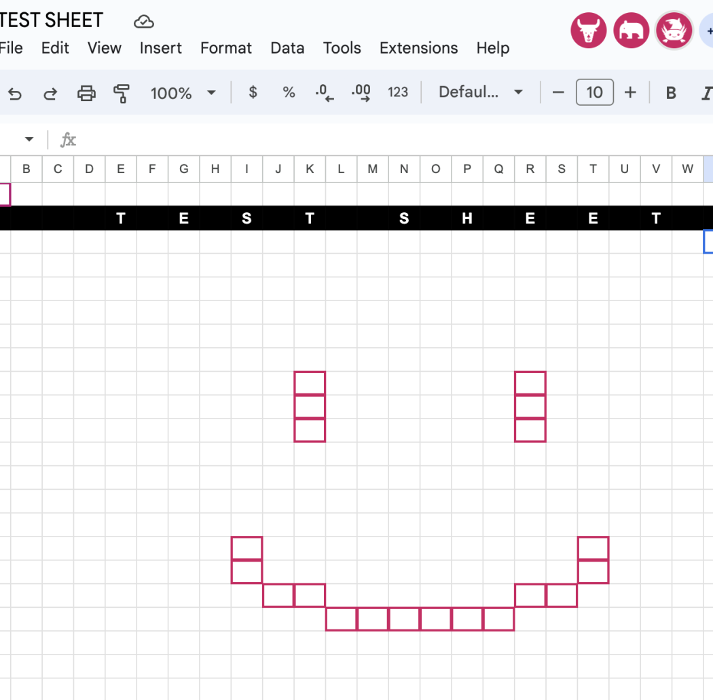

# docbot

Simple headless client for Google Drive file interactions (Docs, Sheets, Slides, etc) in NodeJS v22



## Usage

### Log any users that ever open the doc:

```js

import { docFromUrl, botForDoc, EVENT } from "./docbot.js";

const GOOGLE_DOC_URL = "INSERT URL HERE"; // https://docs.google.com/docs/d/... etc

const doc = docFromUrl(GOOGLE_DOC_URL);

const bot = await botForDoc(doc);
bot.bind();

for await (const event of bot.events) {
    // event is directly from google's servers, so
    // you need to parse yourself. Luckily that is
    // simple
    const [ idx, [ op, ts, data ] ] = event;

    if (op !== EVENT.NEW_USER) continue;

    // For this packet the data is literally the user
    console.log("User seen:", data)
}

```

### Click a the first square on a google sheet


```js
bot.bind();

// First we wait for someone else to select, to grab
// the actual inner sheetId and revision index
let sheetId = "";
let revId = "";
for await (const event of bot.events) {
    // event is directly from google's servers, so
    // you need to parse yourself. Luckily that is
    // simple
    const [ idx, [ op, ts, data ] ] = event;

    if (op !== EVENT.SELECTION) continue;

    const { selection } = data;

    const [ranges, _ts, _usr, rev, ..._rest] = selection;
    sheetId = ranges[1][1][1][1];
    revId = rev;

    console.log("Found sheet id: " + sheetId);

    break;
}

await bot.select(sheetId, rev, 0, 0);

console.log("Clicked at 0, 0");

await bot.leave();

```

---

License information has been put into ./LICENSE

> THE SOFTWARE IS PROVIDED "AS IS", WITHOUT WARRANTY OF ANY KIND, EXPRESS OR IMPLIED, INCLUDING BUT NOT LIMITED TO THE WARRANTIES OF MERCHANTABILITY, FITNESS FOR A PARTICULAR PURPOSE AND NONINFRINGEMENT. IN NO EVENT SHALL THE AUTHORS OR COPYRIGHT HOLDERS BE LIABLE FOR ANY CLAIM, DAMAGES OR OTHER LIABILITY, WHETHER IN AN ACTION OF CONTRACT, TORT OR OTHERWISE, ARISING FROM, OUT OF OR IN CONNECTION WITH THE SOFTWARE OR THE USE OR OTHER DEALINGS IN THE SOFTWARE.


